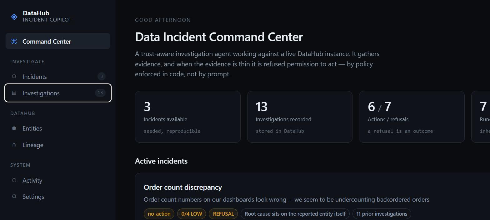
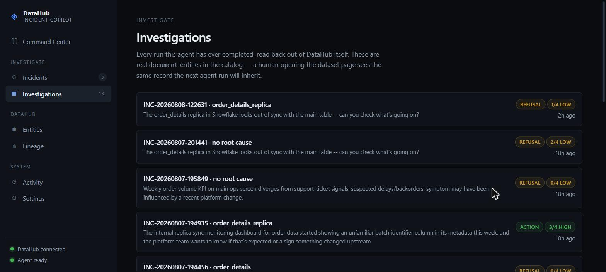
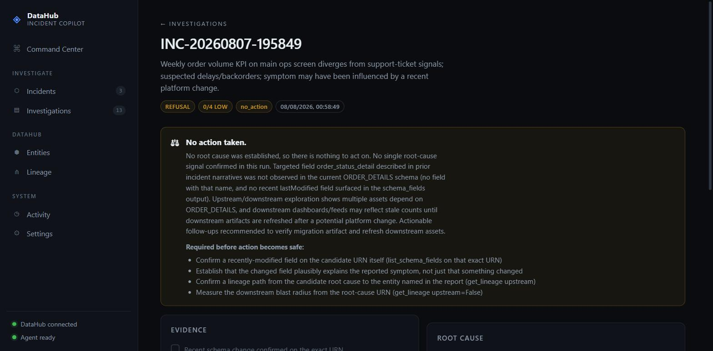
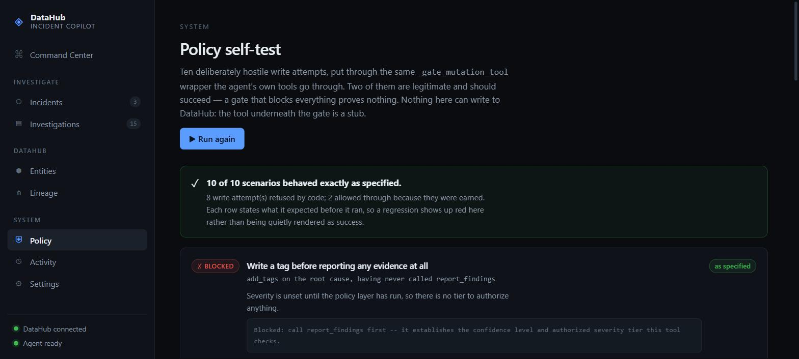

# Incident Copilot

**An LLM agent that investigates data incidents and writes its conclusions back into
DataHub — where the permission to write is a deterministic artifact that expires when
the evidence does.**

The interesting question about an autonomous agent is not whether it can find the root
cause. It's what happens in the gap between deciding to act and acting. Catalogs move.
A field gets reverted, a mirror gets repaired, an upstream is rebuilt — and the
justification the agent was operating on quietly stops being true while it is still
mid-run.

So every mutation here carries an **authorization proof**: the predicates it rests on,
where in DataHub each one was observed, the exact URNs it covers, and a hash over all of
it. The id is a function of the grounds, so the same evidence about the same entities
always produces the same `AUTH-…`.

**And the proof is re-read at the instant of the write, not trusted from when it was
issued.** A predicate that stopped holding revokes exactly the targets it was grounding:

```
AUTH-4c5f655da127  ALLOW      →  add_tags on order_details          ✓ written, read back
   P3 [✓] Field `order_status_detail` is present on the root-cause entity
          schemaMetadata · list_schema_fields · …order_details → observed 'current'

   ── the field is removed from DataHub. nobody tells the agent. ──

AUTH-4c5f655da127  REVOKED    →  add_tags on order_details          ✗ refused
   P3 [✗] observed 'current' → now 'stale'
```

The agent didn't change its mind. It was never asked. The evidence changed, so the
authority changed — in Python, with no model in the process.

Run it yourself: **`python counterfactual.py`** does exactly the above against a live
instance, then puts the field back.

**Don't trust the hash — recompute it.** Every stored card carries the grounds its id was
computed from, so `python verify_authorization.py` rebuilds every authorization this agent
ever issued straight out of the catalog and tells you whether the numbers were derived or
decorative. Editing a stored proof makes it fail.

---

The rest of the design follows from the same rule: the model supplies evidence, and
nothing else.

**Whether the agent is allowed to write is decided in Python, never by the LLM.** The
model supplies evidence — which of four checks a tool call actually confirmed. Confidence
is `confirmed / total`. Severity is a fixed function of confidence and blast radius. Below
a threshold, the write-back tools refuse to run at all: not discouraged in a prompt,
blocked in `decision.py`. The model can't argue its way past arithmetic.

Most data-incident agents also answer a question once and forget it. The next time the
same dashboard looks wrong, the next run starts cold: same searches, same lineage walks,
same dead ends. Incident Copilot treats that as a design problem too.

**A refusal is not a failed run — it's the output.** Every investigation, including one
that refuses to act, ends by writing an **Investigation Card** into DataHub as a
`document` entity linked to the assets it was about. The card records what was checked,
what was missing, which hypotheses were disproven, why action was withheld, and *exactly
what evidence would make action safe next time*. A human opening the dataset page in
DataHub sees the same card the next agent run will read.

**The next investigation continues instead of restarting.** Before anything else, the
agent recalls the cards stored for this incident, inherits the checks already confirmed,
skips the hypotheses already ruled out, and spends its tool calls only on what's still
missing or may have changed. Uncertainty from run 1 becomes the agenda for run 2.

**And it doesn't trust that knowledge either.** A stored card is a true record of *when it
was written*, not a standing fact about the graph. Before any of it counts, every recalled
card naming a concrete claim — a field on a specific URN — has that claim **re-tested
against live DataHub**: `confirmed`, `conflict`, or `unverifiable`. A contradicted card is
withdrawn as evidence entirely, which lowers confidence and can pull severity down to
`no_action`. Verified live: an agent claiming all four checks as inherited had two of them
withdrawn by the graph, dropping it a full severity tier. Memory that can't be wrong is
just a faster way to be confidently stale.

## See it without cloning anything

**Live: [incident-copilot-demo.centralindia.cloudapp.azure.com](https://incident-copilot-demo.centralindia.cloudapp.azure.com)** —
running against a real DataHub instance with the showcase-ecommerce datapack loaded. Pick
an incident and watch the policy layer resolve in real time.



Every investigation ever run, read back out of DataHub as `document` entities — refusals
included, with `↩ continues` chains between them:



A refusal, opened. The reason and the "required before action becomes safe" list are
**derived from which checks failed**, not written by the model:



## Don't take the safety claim on faith — attack it yourself

In a healthy investigation the write-back gate never fires, which makes the most important
behaviour in the project the one a live demo is least likely to show. "The model didn't
misbehave while you watched" is not evidence.

So **[Policy → Run the attacks](https://incident-copilot-demo.centralindia.cloudapp.azure.com/#/policy)**
stages thirteen hostile write attempts against the real `_gate_mutation_tool` wrapper —
imported, not reimplemented — including the two that actually happened during development:
a run that tagged an entity it wasn't authorized to touch, and a URN smuggled past the
check as a bare string. Two of them move DataHub *underneath* a live authorization and
confirm it is revoked. Three scenarios are legitimate and *should* succeed — including one
where the grounds still hold at write time, because a re-check that only ever revokes
proves nothing. Nothing can reach DataHub either way: the tool beneath the gate is a stub.



## It is not a script, and the catalog proves it

Fixed scenario buttons are a fair thing to be suspicious of, so here is the receipt rather
than a promise. The **same prompt, run seven times** against this instance produced **three
different outcomes**, all still visible under Investigations:

| Runs | Confidence | Decision | Root cause reached |
|---|---|---|---|
| × | 0/4 | REFUSAL `no_action` | none — search resolved a different, plausible table |
| × | 3/4 | ACTION `tag_note_escalated` | `order_details` |
| × | 4/4 | ACTION `tag_note_escalated` | `order_details` |

The low-severity scenario likewise produced 1/4 and 2/4 on two runs, reaching a root cause
once and not the other time. **A hardcoded path cannot fail**, and it cannot disagree with
itself. The tool-call traces diverge too — one run skipped entity resolution entirely
because recalled memory already supplied the URN.

## The demo, in two runs

**Run 1 — the agent refuses.** Evidence comes back 2/4. Confidence LOW → severity
`no_action` → `add_tags` and `update_description` are blocked at the code level. Zero
writes to the catalog. But the run is not empty: card `INC-…` lands in DataHub saying
*"lineage path not confirmed; downstream blast radius never measured; establish those and
action becomes safe."*

**Run 2 — the environment has changed, and the agent picks up where it left off.** Recall
returns that card. The agent doesn't re-run the two confirmed checks; it goes straight for
the two missing ones. Now 4/4 → HIGH → severity `tag_note_escalated` → tags and an
incident note are written to the exact root-cause URN, then re-read from DataHub to prove
they landed. A second card is written, linked back to the first.

Same code, same prompt. What changed is that the agent had prior knowledge — and the
policy layer, not the model, decided that the knowledge was now sufficient.

## Why the trust layer is code, not prompt

Four things the model is never allowed to decide for itself:

| Decision | Decided by | Where |
| --- | --- | --- |
| Confidence level | `confirmed / total` on a 4-item checklist | `decision.py` |
| Severity tier | `f(confidence, datasets, dashboards, criticality, stale mirrors)` | `decision.py` |
| Whether a write may happen | severity gate wrapping the mutation tools | `mcp_client.py` |
| *Which entity* a write may touch | `_authorized_targets`: the confirmed root cause, plus mirrors code proved stale | `mcp_client.py` |
| Whether the permission **still holds at write time** | grounding predicates re-read from DataHub inside the gate | `authorization.py` |

That last row exists because of a bug this project found in its own trace. Severity
answered *how much* the agent may do and never *to what* — so a run quietly tagged a
mirror table alongside the real root cause, while the authorization text it had just been
handed said "the exact root-cause URN". The rule had only ever lived in the prompt. Now
the permitted set is derived in Python from what was actually confirmed, and anything else
is refused before the tool runs.

And three integrity properties that follow from it:

- **Inherited evidence is verified, not taken on faith.** If a run claims it carried a
  check forward from a prior card, that claim is checked against the cards recall actually
  returned. Unbacked claims don't just lose a badge — the check is reset to unconfirmed,
  which lowers confidence and can pull severity back down to `no_action`. (This is a real
  fix, not a hypothetical: a validation run claimed to inherit a check from cards that had
  confirmed nothing.)
- **The card is built by Python, not written by the LLM.** The model supplies evidence;
  every derived field — confidence, severity, the refusal reason, the required-before-retry
  list — is computed. Two runs with identical evidence produce identical cards.
- **Write-backs are verified.** Every successful mutation re-reads the entity from DataHub
  and shows the tag or note present, rather than reporting a bare `success: true`. The card
  write-back does the same.

- **A read of the graph outranks the model's checklist.** If the agent reports a field as
  the root cause and DataHub says that field isn't there, the proof comes back `DENY` and
  the write is blocked even at a tier that would otherwise permit it. Being *unable* to
  read, though, never denies and never revokes: an absence you couldn't confirm is not
  evidence of absence — the same rule `mirror_audit` and `revalidate` already follow.

The severity gate covers *acting on the data*. It deliberately never covers *recording
what was learned* — the lower the confidence, the more valuable the record.

## Finding what the lineage graph can't tell you

DataHub's lineage is topologically honest: if two datasets are connected, that connection
is real. It has no concept of whether the connection is *schema-safe*. The same real-world
table replicated onto another platform can silently keep the old schema after the source
changes shape, and the graph keeps drawing the same edge either way — an edge asserts
connectivity, never parity.

So `report_findings` asks the question the graph doesn't, automatically: whenever it has a
confirmed root cause and the field that changed, it walks two hops in both directions,
name-matches same-entity siblings across platforms, and confirms field-by-field whether
each one actually picked up the change — the same demotion-not-request pattern as the rest
of this table, not a tool the agent has to remember to reach for. On DataHub's own
showcase-ecommerce datapack, the dbt `order_details` model has three such mirrors —
snowflake, looker, powerbi — and **all three were running stale schema**. Only the
snowflake copy is a 1-hop sync; the other two read from *that* copy, so a 1-hop check
would have missed two of the three real findings.

This matters operationally: those mirrors keep producing the same symptom after the root
cause is fixed, until someone updates them independently. Two or more confirmed-stale
mirrors is also a code-verified escalation signal feeding `compute_severity` — and, per the
table above, the only thing besides the root cause that a write-back is permitted to touch.

## Live demo

https://incident-copilot-demo.centralindia.cloudapp.azure.com — pick a scenario, watch the
agent investigate a real DataHub instance in your browser, no setup required. Same agent
and tool code path as the CLI, streamed over SSE.

Built for the [DataHub Agent Hackathon](https://datahub.devpost.com/), Track 1 ("Agents
That Do Real Work").

## Architecture

- `src/incident_copilot/authorization.py` — the authorization proof: predicates grounded
  in DataHub aspects, a content-addressed id, and `recheck_authorization`, which the gate
  calls at write time so a permission can be revoked rather than merely granted
- `verify_authorization.py` — recomputes every stored authorization from the grounds
  recorded on its own card, so the determinism claim is a command rather than a promise
- `counterfactual.py` — the whole arc against a live instance: issue, write, remove the
  field, re-check, refuse, restore
- `src/incident_copilot/memory.py` — the Investigation Card: model, markdown+JSON
  rendering, exact parse-back, the Python-driven `recall_prior_investigations` tool and the
  ungated `write_investigation_card` tool
- `src/incident_copilot/decision.py` — the trust layer: evidence checklist → confidence →
  severity, the inheritance validator, the refusal reason and required-before-retry
  derivation, and the `report_findings` checkpoint the agent must clear before write-back
- `src/incident_copilot/mcp_client.py` — connects to the DataHub MCP server; wraps the
  mutation tools in the severity and target gates, records real provenance and real actions
  taken, and auto-verifies successful write-backs by re-reading the entity
- `src/incident_copilot/mirror_audit.py` — the cross-platform schema-drift check: finds
  same-entity mirrors via lineage and confirms in code whether each still has the changed
  field. Run automatically by `report_findings`, not on the agent's initiative, so the
  agent can never merely assert a mirror is stale, or skip the check by not asking
- `src/incident_copilot/agent.py` — the agent loop, bound to DataHub's MCP tools; it
  chooses its own investigation path rather than following a fixed script — three incident
  shapes take three verifiably different paths through the same code
- `src/incident_copilot/narrate.py` — live, first-person narration of the actual tool calls
  and reasoning as they happen
- `seed_data.py` — loads DataHub's real showcase-ecommerce datapack and locks the incident
  trigger points used for the demo
- `src/incident_copilot/revalidate.py` — re-tests each recalled card's claim against live
  DataHub before it may count as evidence; only a contradiction withdraws a card, because
  an absence you couldn't confirm is not evidence of absence
- `src/incident_copilot/datahub_api.py` — read-only GraphQL used by the web UI's explorer
  views, deliberately separate from the agent's MCP path so nothing there can write
- `src/incident_copilot/panel.py` — snapshots the live policy state for the UI; computes
  nothing, so the panel can't disagree with the gate
- `cli.py` — entry point: `python cli.py "our revenue dashboard looks wrong"`
- `webapp.py` + `web/` — the application: command center, live investigation workspace,
  investigation history, interactive lineage graph, entity explorer, status
- `examples/` — unedited recorded investigation output

**172 tests, no live DataHub needed** — `python tests/test_<name>.py`, each exits non-zero
on failure:

| Suite | Covers |
|---|---|
| `test_authorization_proof.py` (45) | insufficient evidence denies, sufficient allows, an authorized write lands, a **changed predicate revokes** and the identical write is then refused, revocation stays scoped to the entity whose grounds moved, unreadable never revokes, and the id is reproducible from the card alone while a tampered one fails |
| `test_write_back_gate.py` (19) | what the gate blocks and permits, and that a refusal returns in the shape LangChain demands rather than crashing the run |
| `test_report_findings_drift.py` (11) | when the schema-drift audit runs, when it cleanly stays off, and that a malformed tool response can't crash the mandatory checkpoint |
| `test_shipped_scripts.py` (14) | that the ops watchdog parses, probes the GraphQL resolver that actually fails rather than the RestLi one that survives, checks the public URL end to end, and repairs in the right order |
| `test_panel_snapshot.py` (45) | that a blocked mutation and a revoked authorization both reach the UI, and that nothing is invented before the policy layer has run |
| `test_prior_knowledge_revalidation.py` (20) | that stale memory is withdrawn, that unverifiable memory is *not*, and that a withdrawal really does block the write-back |
| `test_web_bundle.py` (18) | that the shipped UI actually parses — a JS syntax error blanks every view at once while the server still answers 200 |

Under the hood: DataHub OSS + its MCP server, a LangGraph ReAct loop, Azure OpenAI. Those
are implementation choices; the thing being built is the trust and memory layer around
them.

## Scope, stated honestly

What this does not do, so nobody has to find out by being disappointed:

- **Revocation covers schema predicates only.** A grounding predicate is "field X is
  present/absent on URN Y", re-read from `schemaMetadata`. Ownership changes, tag changes,
  deprecation and lineage rewiring are *not* currently grounds, so they cannot revoke an
  authorization. The mechanism generalizes to any re-readable predicate; only these are
  implemented and tested.
- **It is not a claim verifier.** It does not adjudicate whether the agent's prose is true.
  `revalidate.py` does a narrow version of that — enough to decide which stored evidence
  may still count — and no more. If you want rigorous verification of what an agent
  asserted about a catalog, that is a different and worthwhile problem.
- **The policy is code, not configuration.** Tiers, thresholds and the target rules live in
  `decision.py` / `mcp_client.py`. There is no policy DSL and nothing is operator-editable
  without a code change. That was a deliberate trade for reviewability at this size.
- **One incident domain, three seeded scenarios.** The agent chooses its own path and
  reaches genuinely different conclusions across runs, but it is pointed at a data-quality
  incident on one datapack, not at arbitrary catalog work.
- **MCP reads are taken at face value.** The agent reads DataHub exclusively through the
  official MCP server and does not independently cross-check those reads against GraphQL.
  If the transport misreports a schema, the proof inherits that error.
- **The demo runs on a single VM** with a cron watchdog for a recurring OpenSearch failure.
  It is a demo, not an SLA.

## Contributed back upstream

Both of these are real bugs this project hit while building against the official MCP server,
found by running the agent rather than reading the code. Both are **submitted, not merged.**

**[acryldata/mcp-server-datahub#198](https://github.com/acryldata/mcp-server-datahub/pull/198)
— `sort_by="relevance"` breaks every search.** The tool exposes `sort_by`, and an LLM fills
in `"relevance"` unprompted, because asking for "the best-ranked results" is idiomatic and
indistinguishable in intent from not sorting at all. But relevance isn't a field — it's the
name of the default ranking — so DataHub OSS has nothing to sort on and rejects the query:

```
query_shard_exception: No mapping found for [relevance] in order to sort on
-> search_phase_execution_exception: all_shards_failed   (HTTP 400)
```

It presents as a search-backend outage while actually being an unvalidated argument, so the
agent correctly concluded the backend was down and refused to act — every search that run.
The fix normalizes it to a no-op. Worked around locally in `_wrap_search_sort_compat`.

**[acryldata/mcp-server-datahub#155](https://github.com/acryldata/mcp-server-datahub/pull/155)
— `entity_type = report` looks valid and isn't.** A model resolving a BI dashboard guessed
it, got zero results, and burned retries before recovering. PowerBI/Tableau/Looker report
artifacts are indexed as `dataset`, and the filter docs didn't say so.

Both share a root cause worth naming: an LLM caller's natural-sounding guess isn't validated
against what the tool actually accepts. That's a category of bug MCP servers will keep
hitting as agents become the primary callers.

## Setup

Requires Docker (for DataHub's local quickstart), Python 3.11+, and an Azure OpenAI
deployment (any OpenAI-compatible chat model with tool calling works; swap the
`AzureChatOpenAI` import in `agent.py` if using a different provider).

```bash
uv sync
cp .env.example .env   # fill in AZURE_OPENAI_ENDPOINT / AZURE_OPENAI_API_KEY, DATAHUB_GMS_TOKEN if needed
datahub docker quickstart
python seed_data.py
python cli.py "our revenue dashboard looks wrong"
# run it a second time -- it will recall the first investigation and continue it
```

## License

Apache 2.0 — see [LICENSE](./LICENSE).
